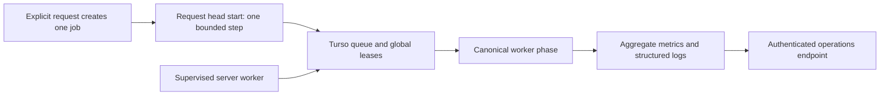

# Public scan worker operations

This runbook covers the canonical durable public-scan queue. It does not permit
global recollection, version aliases, direct score writes, or unbounded
request-side queue draining.

## Processing model



The server worker is the primary consumer. A request head start is optional and
can only address the job atomically created by that request. A busy execution
slot returns its claim to the ready queue without changing attempt count or
schedule. Storage and metrics failures are distinct from an empty queue or a
busy slot.

## Start the worker

Run the worker under a process supervisor on a server that has the existing
Turso and GitHub API environment variables:

```ini
[Service]
WorkingDirectory=/srv/ghfind
ExecStart=/usr/bin/env pnpm public-scan:worker
Restart=always
RestartSec=5
Environment=PUBLIC_SCAN_WORKER_CONCURRENCY=2
```

The default concurrency is two lanes and the enforced maximum is four. The
capacity is persisted in Turso, so web-request head starts share the same
global limit. Do not increase it to silence alerts; first inspect GitHub quota,
per-phase duration, and error rate.

## Aggregate endpoint

Use an operator credential only in a private shell. Do not paste its value into
issues, pull requests, logs, or screenshots.

```bash
curl -fsS -H "x-admin-secret: $ADMIN_SECRET" \
  "$BASE_URL/api/admin/public-scan-jobs"
```

The response contains no account names, IP addresses, payloads, lease tokens,
or error text. Its `metrics` object includes:

| Field | Meaning |
| --- | --- |
| `queue.depth` | Canonical queued plus running jobs |
| `queue.ready` / `queue.deferred` | Ready now versus scheduled for later |
| `queue.oldestAgeMs` | Age of the oldest active canonical job |
| `queue.byPhase` | Queued/running counts for each bounded phase |
| `failures.*` | Current failed jobs and cumulative retry/terminal steps |
| `execution.*` | Active slots, configured capacity, and cumulative contention |
| `steps[]` | Per-phase/outcome count, average duration, and maximum duration |
| `worker.lastSuccessAt` | Last successfully completed worker iteration |
| `worker.consecutiveFailures` | Consecutive worker iteration failures |

## Initial alerts

| Signal | Warning | Critical |
| --- | --- | --- |
| Time since `worker.lastSuccessAt` | 2 minutes | 5 minutes |
| `queue.oldestAgeMs` | 10 minutes | 20 minutes |
| `queue.depth` | 18 | 24 |
| New `failed_terminal` steps | any | 3 within 15 minutes |
| `worker.consecutiveFailures` | 1 | 2 |

## Safety checks

- `GET /api/scan-status/:username` must not change queue state or invoke GitHub.
- Repeating a request for an existing pending job must not create another job.
- Slot contention must leave `attempt_count` and `next_run_at` unchanged.
- The worker must only use the existing Turso queue APIs; never import scraped
  data directly into `scores`, snapshots, or ranking tables.
- Disabling the worker stops consumption but does not delete jobs. Use the
  existing aggregate inventory and bounded quarantine switch for release work.
