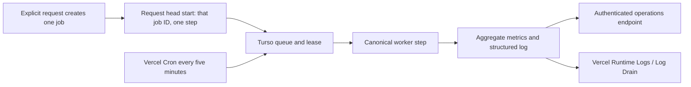

# Public scan monitoring

This runbook covers the canonical durable public-scan queue. It does not permit
global recollection, version aliases, or request-side queue draining.

## Processing model



Cron remains the primary consumer. The request head start is optional and can
only address the job atomically created by that request. A busy execution slot
returns the claim to the ready queue without changing its attempt count or
schedule. Durable-storage and metrics-write failures are distinct from an empty
queue or a busy slot: the Cron endpoint returns `503` and never emits a healthy
`status: "ok"` response for those failures.

## Aggregate endpoint

Use an operator credential only in a private shell. Do not paste its value into
issues, pull requests, logs, or screenshots.

```bash
curl -fsS -H "x-admin-secret: $ADMIN_SECRET" \
  "$BASE_URL/api/admin/public-scan-jobs"
```

The response contains no account names, IP addresses, payloads, lease tokens,
or error text. Its `metrics` object includes:

| Field | Meaning |
| --- | --- |
| `queue.depth` | Canonical queued plus running jobs |
| `queue.ready` / `queue.deferred` | Ready now versus scheduled for later |
| `queue.oldestAgeMs` | Age of the oldest active canonical job |
| `queue.byPhase` | Queued/running counts for each bounded phase |
| `failures.*` | Current failed jobs and cumulative retry/terminal steps |
| `execution.*` | Active slot, fixed capacity, and cumulative contention |
| `obsoleteActiveJobs` | Active jobs outside the canonical collection |
| `steps[]` | Per-phase/outcome count, average duration, and maximum duration |
| `cron.lastSuccessAt` | Last successfully completed Cron invocation |
| `cron.consecutiveFailures` | Consecutive dispatcher-level Cron failures |

Step counters are cumulative. Alerting systems must compare successive samples
to derive rates.

## Structured logs

The worker emits `public_scan.step` and `public_scan.cron` records. Step records
contain only source, status, opaque job/run IDs, phase, duration, and retry state.
They never contain account names, IP addresses, request headers, credentials, or
raw upstream errors. Roast request summaries use an opaque request ID instead of
an account name.

Vercel documents Runtime Log filtering and structured application logs at:

- <https://vercel.com/docs/logs/runtime>
- <https://vercel.com/kb/guide/add-structured-application-logs-to-vercel-functions>
- <https://vercel.com/docs/cron-jobs/manage-cron-jobs>

## Owner configuration

Production configuration requires project-owner access:

1. Deploy the reviewed `dev` commit with the production-equivalent Cron secret.
2. In **Settings > Cron Jobs**, open **View Logs** for
   `/api/internal/public-scan` and verify recurring HTTP 200 responses plus
   `public_scan.cron` records with `status: "ok"`.
3. In **Observability > Alerts**, configure a route-level error anomaly for the
   Cron endpoint and deliver it to at least two destinations. Vercel's built-in
   alerts require a supported paid plan; see <https://vercel.com/docs/alerts>.
4. For application thresholds below, configure a Log Drain or an external
   monitor that samples the aggregate endpoint. Vercel Drains are documented at
   <https://vercel.com/docs/drains>.
5. Trigger one synthetic durable scan on `dev`; confirm its request log advances
   only its opaque job ID and a later Cron can resume it.

## Initial alert thresholds

With the checked-in five-minute schedule:

| Signal | Warning | Critical |
| --- | --- | --- |
| Time since `cron.lastSuccessAt` | 11 minutes | 20 minutes |
| `queue.oldestAgeMs` | 15 minutes | 30 minutes |
| `queue.depth` | 18 | 24 |
| New `failed_terminal` steps | any | 3 within 15 minutes |
| New `slot_busy` steps | 3 within 15 minutes | 6 within 15 minutes |
| `cron.consecutiveFailures` | 1 | 2 |
| `obsoleteActiveJobs` after quarantine | any | increasing across two samples |

These are launch thresholds, not permanent capacity targets. Tighten them after
observing the isolated `dev` deployment. Do not increase worker concurrency to
silence an alert; investigate GitHub quota, step duration, and queue admission.

## Verification and rollback

- Polling `GET /api/scan-status/:username` must not change queue state or invoke
  GitHub.
- Repeating a request for an existing pending job must not start after-work.
- Slot contention must leave `attempt_count` and `next_run_at` unchanged.
- A missing or unavailable durable store must make the Cron endpoint return
  `503 public_scan_unavailable`, never an empty-queue `200`.
- Disabling Vercel Cron stops scheduled consumption but does not delete jobs.
- Never quarantine a valid running lease; use the existing dry-run inventory and
  bounded operator switch from the release runbook.
