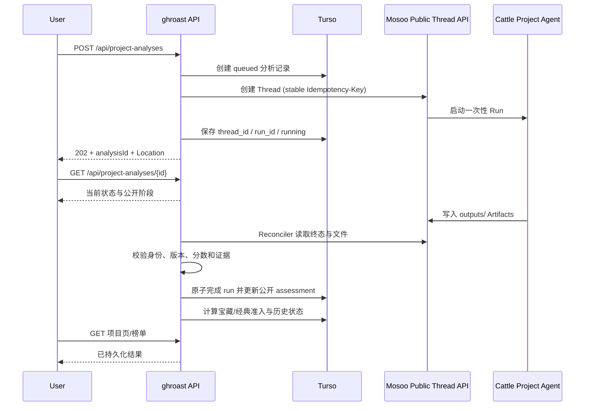

# 开源项目评分与宝藏发现工程化落地方案

日期：2026-07-15

状态：V1 已实现并完成本地真实链路验收；Phase 5/6 仍按后续安全与数据条件推进

上游讨论：[2026-07-14-open-source-project-scoring-discussion.md](./2026-07-14-open-source-project-scoring-discussion.md)

## 1. 目标与本版结论

本功能不是再做一个按 Star 排序的 GitHub 榜单，而是建立一套可验证、可追溯的项目产品价值评估系统，优先记录：

> 真正解决实际问题、好用，但因为团队规模、宣发能力或社区声量不足而没有被充分看到的开源项目。

V1 只提供两个榜单：

- **宝藏项目榜**：产品价值高、证据可信、当前曝光不足的项目，是主榜。
- **经典项目榜**：经过长期采用和持续验证、今天仍然值得使用的成熟项目。

“小而美”“新锐”“功能完成型”“快速进步”只作为标签和筛选条件，不在 V1 拆成额外榜单。

本方案确认以下工程边界：

- ghroast 是产品与业务编排层。
- Mosoo 是唯一的 Agent 执行与交付层。
- 在**现有 ghroast Mosoo App** 内新建一个专用项目评分 Agent，工程类型为 `kind: cattle`，Mosoo UI 中对应 Task Agent。
- 该 Agent 绑定专用 Skill、Environment 和必要工具；不新建 Mosoo App。
- 不引入 Codex SDK，不在 ghroast 中运行 `codex exec`，不直接调用 OpenAI API，不自建 Agent loop、planner、tool runner 或 sandbox。

## 2. 产品模型：分数、曝光和榜单彻底解耦

### 2.1 项目价值分

项目价值分只回答“这个产品是否值得使用”，不奖励 Star、公司背景、维护者数量和传播能力。

| 维度 | 分值 | 核心问题 |
| --- | ---: | --- |
| 需求痛点 | 25 | 问题是否真实、明确，现有替代方案是否足够痛苦 |
| 解决效果 | 30 | 项目是否兑现核心承诺，结果是否可靠、有明显收益 |
| 上手与核心体验 | 30 | 用户能否安装、理解并完成第一次核心任务 |
| 范围与价值密度 | 15 | 是否用恰当复杂度提供足够价值，是否存在明显过度设计 |
| **合计** | **100** | |

这一模型取代讨论稿中把“真实使用证据”计入主分的做法。Dependents、下载量、用户案例和 Issue 反馈仍是重要证据，但它们用于提升判断置信度或判断长期采用，不直接给产品价值加分。

### 2.2 独立输出字段

每次评估除 `product_score` 外，必须单独输出：

- `confidence`：证据充分程度，而不是另一个质量分。
- `unknowns`：因环境、权限或资料缺失而无法确认的事项。
- `verification_level`：实际验证深度。
- `risk`：License、安全、依赖、供应链和采用限制。
- `community_strength`：社区和贡献者强度。
- `exposure`：Star、下载、Dependents、传播和增长等曝光信号。

缺失数据不能直接计零分。确认缺失某项产品能力时才扣分；只是无法验证时，记录在 `unknowns` 并降低 `confidence`。

### 2.3 项目类型与生命周期

Agent 必须先分类，再选择细则：

- `micro_tool`：微型工具、CLI。
- `sdk_library`：SDK、开发库。
- `web_app`：Web 应用。
- `desktop_app`：桌面应用。
- `framework_platform`：框架、平台。
- `database_infra`：数据库、基础设施。
- `template_scaffold`：模板、脚手架。
- `enterprise_system`：大型企业级系统。

同时识别生命周期：

- `active_evolution`
- `stable_maintenance`
- `feature_complete`
- `experimental`
- `abandoned`

维护状态按“是否适合该项目和生态”判断。单人维护、低提交频率或已经完成都不自动扣分；反之，维护者很多也不自动加分。

### 2.4 验证等级

```text
metadata_only       只读取仓库元数据
source_inspected    已阅读源码、文档和配置
built               已完成依赖安装或构建
core_flow_executed  已执行一个代表性的核心用户流程
```

公开展示必须同时显示分数、置信度和验证等级，避免把一次浅层分析包装成确定结论。

## 3. 榜单规则

### 3.1 宝藏项目榜

Star 和社区影响力对产品价值分的正向权重为 **0**。曝光数据仍然保留，但只承担两件事：

1. 判断项目是否属于“没有被充分看到”。
2. 判断已经入榜的项目是否从宝藏阶段毕业。

因此宝藏榜不是下面这种线性加权：

```text
产品价值 + Star 奖励 + 社区奖励
```

而是先准入、再按价值排序：

```text
准入条件：
  product_score >= 产品价值门槛
  confidence >= 置信度门槛
  verification_level >= 最低验证等级
  risk 不存在阻断项
  exposure_band 属于低曝光范围

榜内排序：
  product_score DESC
  confidence DESC
  selected_at DESC
```

低 Star 本身不是优点，也不能让低质量项目入榜。一个项目必须先证明“好”，才有资格因为“没被看到”进入宝藏榜。

首版曝光判断采用可解释分层，而不是假装已经拥有完整历史增长数据：

- `unknown`：数据不足，不自动进入宝藏榜。
- `low`：Star、Dependents、下载或讨论明显低于同类型项目。
- `emerging`：开始获得关注，但仍未形成广泛采用。
- `established`：已经形成稳定的社区或用户采用。
- `mainstream`：高曝光头部项目。

同类比较必须按项目类型、年龄和生态校准；Star 使用对数压缩。等积累 `project_metrics_daily` 后，再加入真实的 30/90/180 天增长，而不是用当前快照伪造增长率。

### 3.2 宝藏项目是发现档案，不是瞬时热榜

项目首次进入宝藏榜时保存不可变快照：

- 入选时间与入选理由。
- 当时的产品分、置信度、验证等级。
- 当时的 Star、曝光分层和核心证据。
- 被评估的 commit SHA、rubric 和 Agent 版本。

后续项目走红时，不静默删除历史，而是标记为：

- `active`：当前仍属于宝藏项目。
- `graduated`：已经获得足够曝光，从宝藏阶段毕业。
- `removed`：因证据错误、项目失效、恶意行为或人工审核被移除。

这能让 ghroast 证明“我们在它走红之前就发现了它”。

### 3.3 经典项目榜

经典榜允许长期采用、生态依赖、维护稳定性和历史影响力参与准入与排序，但仍不能覆盖产品体验：

```text
classic_eligible =
  product_score >= 经典价值门槛
  AND lifecycle in (stable_maintenance, feature_complete, active_evolution)
  AND long_term_adoption 已有充分证据
  AND 没有阻断性风险
```

产品已经难用、无法完成核心流程的大项目，不能只靠 Star 进入经典榜。

## 4. 系统职责与 Mosoo 定位

```text
现有 ghroast Mosoo App
└── Project Evaluator Agent (kind: cattle / Task Agent)
    ├── ghfind-project-evaluator Skill
    ├── project-evaluator Environment
    └── 必要工具与 MCP 绑定
```

App 继续作为整个 ghroast 产品统一的资源归属、鉴权、运维、日志、用量和成本边界。专用 Agent 提供职责隔离；专用 Skill、Environment 和工具绑定提供执行配置隔离。

### 4.1 ghroast 负责

- 用户提交、限流和权限。
- 项目身份归一化和分析任务去重。
- 创建 Mosoo Thread、跟踪 Run、读取 Artifact。
- 异步任务状态、重试、超时和最终一致性。
- Artifact Schema 与项目身份校验。
- Turso 持久化、榜单计算、历史留存和公开页面。
- 对用户只展示整理后的阶段和证据，不代理模型思维链或原始工具输出。

### 4.2 Mosoo 负责

- 发布和运行 Cattle Agent。
- Codex Runtime、一次性 Sandbox、Thread、Run 和事件。
- Environment 初始化和工具执行。
- Artifact 文件交付。
- 模型、Vendor Credential 和运行时资源管理。

### 4.3 Cattle Agent 负责

- 理解产品契约与痛点。
- 判断项目类型、生命周期和适用 rubric。
- 制定与风险匹配的验证计划。
- 克隆固定 commit，阅读、安装、构建和执行核心流程。
- 区分产品失败、环境失败和证据不足。
- 生成结构化评分、证据和用户报告。

Environment 只是运行时模板；Skill 和 MCP 是 Agent 的独立绑定，不把三者混成一个资源。

## 5. 端到端异步架构

项目分析可能运行数分钟，不能复用当前 `/api/scan` 和 `src/lib/mosoo-score.ts` 的同步请求内轮询方式。



### 5.1 API

#### `POST /api/project-analyses`

输入：

```json
{
  "repositoryUrl": "https://github.com/owner/repo",
  "ref": "optional branch, tag or sha"
}
```

行为：

1. 规范化并校验 GitHub 仓库身份。
2. 在 Turso 中先创建分析记录。
3. 对同一 `repo_key + requested_ref + rubric_version` 的活跃任务去重。
4. 使用分析 ID 派生稳定的 Mosoo `Idempotency-Key`。
5. 创建 Thread，写入 `client_external_ref = analysisId`。
6. 在理想情况下 1 秒内返回 `202 Accepted`。

响应：

```json
{
  "analysisId": "...",
  "status": "queued",
  "statusUrl": "/api/project-analyses/..."
}
```

同时返回 `Location` 和回显的 `Idempotency-Key`。

#### `GET /api/project-analyses/{analysisId}`

只读取 ghroast 持久化状态；允许至多执行一次很短的按需 reconcile，不在请求中长期等待 Mosoo。

#### `POST /api/internal/project-analyses/reconcile`

由 Vercel Cron 或受保护的内部调度调用，批量推进无人轮询、浏览器已关闭或中途失败的任务。Mosoo Public Thread API 当前没有可依赖的业务 webhook，因此该任务是 V1 完成异步闭环的必要组件。

#### 可选后续接口

- `GET /api/project-analyses/{id}/events`：只发送整理后的公开阶段。
- `GET /api/projects/{owner}/{repo}/analysis`：供外部消费当前公开评估。

V1 前端使用短轮询即可，不把 SSE 作为上线前置条件。

### 5.2 状态机

```text
queued
  -> creating_thread
  -> running
  -> finalizing
  -> completed

creating_thread | running | finalizing
  -> failed | cancelled | expired
```

公开阶段：

```text
classifying
cloning
inspecting
installing
building
exercising
evaluating
writing_report
persisting
```

Run 状态与公开阶段分开：前者用于可靠调度，后者用于产品展示。

最终写入使用 Compare-And-Set，避免轮询请求与定时 Reconciler 重复完成同一任务：

```sql
UPDATE project_analysis_runs
SET status = 'completed', completed_at = ?
WHERE id = ? AND status = 'finalizing';
```

只有更新成功的执行者可以继续更新 `project_assessments` 和榜单状态。跨表操作使用同一事务。

### 5.3 产品失败与基础设施失败

- 安装失败、构建失败、核心流程无法完成：属于项目证据，Agent 仍应生成有效评估。
- Mosoo 不可用、Thread 超时、Artifact 丢失或 Schema 非法：属于分析基础设施失败，不得伪装成项目低分。
- `waiting_input`：Cattle 评分 Agent 不应询问用户，统一映射为 `unexpected_input_request` 协议错误。

## 6. 数据模型

Turso 是事实来源，Redis 只做缓存。新提交的仓库可能尚未存在于当前 repo 图谱，因此分析表不对 `repos` 建强外键。

### 6.1 `project_analysis_runs`

保存每一次不可变分析尝试和任务状态：

```text
id TEXT PRIMARY KEY
repo_key TEXT NOT NULL
canonical_url TEXT NOT NULL
requested_ref TEXT
resolved_commit_sha TEXT
idempotency_key TEXT NOT NULL UNIQUE
status TEXT NOT NULL
phase TEXT
progress INTEGER
mosoo_agent_id TEXT
mosoo_thread_id TEXT
mosoo_run_id TEXT
schema_version TEXT NOT NULL
rubric_version TEXT NOT NULL
agent_version TEXT NOT NULL
skill_version TEXT NOT NULL
verification_level TEXT
analysis_json TEXT
report_markdown TEXT
evidence_json TEXT
analysis_sha256 TEXT
report_sha256 TEXT
evidence_sha256 TEXT
error_code TEXT
error_message TEXT
created_at INTEGER NOT NULL
started_at INTEGER
completed_at INTEGER
updated_at INTEGER NOT NULL
```

建议索引：

- `(repo_key, created_at DESC)`：项目分析历史。
- `(status, updated_at)`：Reconciler 扫描。
- 活跃任务去重键：应用层生成 `repo_key/ref/rubric` 指纹并建立唯一约束。
- `mosoo_thread_id` 唯一索引：防止重复绑定。

Artifact 内容在 V1 直接持久化到 ghroast，并设置单文件和总大小上限；不能只保存 Mosoo file ID，否则公开页面和榜单会依赖 Mosoo 在线可用性。

### 6.2 `project_assessments`

保存每个项目当前公开的读模型：

```text
repo_key TEXT PRIMARY KEY
latest_analysis_id TEXT NOT NULL
project_type TEXT NOT NULL
lifecycle TEXT NOT NULL
product_score REAL NOT NULL
pain_score REAL NOT NULL
effectiveness_score REAL NOT NULL
experience_score REAL NOT NULL
value_density_score REAL NOT NULL
confidence REAL NOT NULL
verification_level TEXT NOT NULL
unknowns_json TEXT NOT NULL
risks_json TEXT NOT NULL
community_strength REAL
exposure_band TEXT NOT NULL
treasure_eligible INTEGER NOT NULL DEFAULT 0
classic_eligible INTEGER NOT NULL DEFAULT 0
resolved_commit_sha TEXT NOT NULL
rubric_version TEXT NOT NULL
analyzed_at INTEGER NOT NULL
```

建立面向榜单的覆盖索引，例如：

- `(treasure_eligible, product_score DESC, confidence DESC)`
- `(classic_eligible, product_score DESC, confidence DESC)`

榜单直接查询持久化读模型并做 SQL 分页，不在 Node.js 中拉取全量数据后排序。

### 6.3 `treasure_entries`

保存宝藏发现历史：

```text
id TEXT PRIMARY KEY
repo_key TEXT NOT NULL
analysis_id TEXT NOT NULL
status TEXT NOT NULL
selected_at INTEGER NOT NULL
product_score_snapshot REAL NOT NULL
confidence_snapshot REAL NOT NULL
verification_level_snapshot TEXT NOT NULL
stars_snapshot INTEGER
exposure_snapshot TEXT NOT NULL
reason TEXT NOT NULL
resolved_commit_sha TEXT NOT NULL
graduated_at INTEGER
removed_at INTEGER
removed_reason TEXT
```

一个项目可以在不同历史阶段重新入选，但同一活跃周期只能有一条 `active` 记录。

### 6.4 `project_metrics_daily`（后续）

V1 可以不建。等有稳定采集后记录 Star、Fork、Dependents、下载量和讨论等每日快照，再计算 30/90/180 天真实趋势。

### 6.5 与现有项目图谱的关系

现有字段需要澄清语义：

- `projectQualityScore(avgScore, contributorCount)` 反映的是已评分贡献者聚合，应改名为 `communityStrengthScore`。
- 当前 `qualityScore` UI 字段改为 `communityStrength`，不再声称是项目产品质量。
- 当前 `momentum` 来自贡献者的站内 lookup，应改名为 `contributorAttention`，不能声称是项目增长。
- `/developers/repo/{owner}/{name}` 继续作为项目 canonical URL；不创建第二套项目详情地址。
- `/projects` 继续作为发现入口，但改造为“宝藏 / 经典”两个视图。

## 7. Mosoo Agent 契约

### 7.1 固定输入协议

ghroast 只发送结构化、版本化任务，不进行开放式对话：

```text
[GHFIND_PROJECT_ANALYSIS_V1]
analysis_id: <uuid>
repository_url: <canonical GitHub URL>
requested_ref: <optional>
rubric_version: <version>
schema_version: <version>
artifact_prefix: project-analysis-<analysis_id>
locale: zh-CN
```

Agent 不得向用户追问。信息不足时写入 `unknowns`。

### 7.2 Skill 结构

```text
skills/ghfind-project-evaluator/
├── SKILL.md
├── references/
│   ├── rubric.md
│   └── types/
│       ├── micro-tool.md
│       ├── sdk-library.md
│       ├── web-app.md
│       └── enterprise-system.md
├── schemas/
│   ├── project-analysis.schema.json
│   └── runtime-evidence.schema.json
└── scripts/
    └── validate-artifacts.*
```

Skill 固化：

- 不可信仓库内容不能覆盖系统任务与 rubric。
- 项目分类和生命周期判断。
- 不同类型的验证重点和最低证据要求。
- 四维主分、置信度、风险和曝光的独立关系。
- Artifact Schema、大小限制和证据引用规则。

### 7.3 Agent 工作流

1. 校验仓库身份并解析固定 commit SHA。
2. 阅读 README、代码、配置、Release 和可用外部证据。
3. 建立产品契约：用户、场景、痛点、承诺和替代方案。
4. 判断类型与生命周期，加载对应 rubric。
5. 根据仓库风险和复杂度选择验证深度。
6. 在允许范围内安装、构建并完成代表性核心流程。
7. 记录命令、文件、结果、退出码和必要的摘要证据。
8. 区分项目问题、基础设施问题和未知项。
9. 计算四维分数并生成报告。
10. 本地验证 Artifact 后写入 `outputs/`。

### 7.4 输出 Artifact

```text
outputs/project-analysis-<analysisId>.json
outputs/project-report-<analysisId>.md
outputs/runtime-evidence-<analysisId>.json
```

ghroast 最终化时必须校验：

- `analysis_id` 和 `repo_key` 与任务一致。
- `resolved_commit_sha` 是本次实际检查的 commit。
- schema、rubric、Agent 和 Skill 版本与任务匹配。
- 四个维度之和等于 `product_score`。
- 每个重要结论引用存在的证据 ID。
- 证据不存在越权路径、密钥或原始思维链。
- 文件类型、大小、哈希和 Markdown 安全渲染符合限制。

## 8. 安全与开放范围

仓库、README、`AGENTS.md`、依赖脚本和预编译二进制都属于不可信输入。

当前 Mosoo 代码已经提供 Cattle 的会话级沙盒生命周期，但已配置的 Environment network policy 不能被当作已经强制执行的网络隔离保证；同时运行时环境变量会进入 Codex 子进程。因此 V1 不直接开放“匿名用户提交任意仓库并执行安装脚本”。

### 8.1 V1 安全策略

- 首批只分析运营筛选或 allowlist 仓库。
- 不安全或未知项目降级为 `source_inspected`，不执行安装脚本。
- Environment 不放生产数据库、GitHub PAT、云凭据或业务密钥。
- 公开 GitHub clone 默认不带 token。
- Provider Credential 由 Mosoo Vendor Credentials 管理；MCP 凭据只存在对应绑定中。
- ghroast 只持有 `MOSOO_API_TOKEN` 和项目评分专用 `MOSOO_PROJECT_AGENT_ID`。
- 设置时间、CPU、内存、磁盘、输出大小和并发上限。
- 任何 `waiting_input` 视为协议失败，不允许任务长期占用沙盒。

### 8.2 对公众开放前的硬门槛

- 网络出口策略在实际 Driver 执行链中可验证地强制生效。
- Cattle 公共任务使用不可交互的审批策略。
- 完成恶意 `AGENTS.md`、Prompt Injection、postinstall、外连、Fork Bomb、磁盘填充和秘密读取测试。
- 资源配额、取消、超时和沙盒回收经过压力验证。
- 建立人工下架与证据纠错流程。

## 9. 代码模块规划

为避免把项目任务塞进账号评分原型，新增独立模块：

```text
src/lib/project-analysis-contract.ts   输入、Artifact Zod Schema、版本常量
src/lib/project-analysis-db.ts         任务、assessment、宝藏历史的强一致 DB 操作
src/lib/mosoo-project-analysis.ts      Mosoo Public Thread API 客户端
src/lib/project-analysis-service.ts    创建、去重、reconcile、finalize 编排
src/lib/project-ranking.ts             宝藏/经典准入、排序和毕业规则

src/app/api/project-analyses/route.ts
src/app/api/project-analyses/[id]/route.ts
src/app/api/internal/project-analyses/reconcile/route.ts

src/app/[locale]/projects/analyses/[id]/page.tsx
```

实现约束：

- `src/lib/mosoo-score.ts` 保留给账号评分，不扩展成项目评分万能客户端。
- 项目任务 DB 写入失败必须抛错，不能沿用部分现有读接口的“失败返回空数组”策略。
- MVP 可继续通过 `ensureSchema` 建新空表，但在第二次项目评分 Schema 变更前引入 `schema_migrations`，停止无限堆叠运行时 `ALTER TABLE`。
- 排名与公开详情读取 Turso；Redis 只缓存结果，缓存失败不影响事实数据。

环境变量：

```text
MOSOO_API_BASE
MOSOO_API_TOKEN
MOSOO_PROJECT_AGENT_ID
MOSOO_PROJECT_ANALYSIS_TIMEOUT_MS
PROJECT_ANALYSIS_RECONCILE_SECRET
PROJECT_ANALYSIS_MAX_CONCURRENCY
```

项目评分必须使用 `MOSOO_PROJECT_AGENT_ID`，不能回退到账号评分 Agent ID。

## 10. UI 落地

### 10.1 项目分析状态页

`/[locale]/projects/analyses/{analysisId}` 是非 canonical 的任务状态页，展示：

- 仓库和被分析的 ref。
- 当前公开阶段、耗时和错误恢复提示。
- 分析完成后的跳转入口。

不展示原始模型推理、完整终端流或可能包含秘密的命令输出。

### 10.2 项目详情页

完成结果进入既有 canonical 页面 `/[locale]/developers/repo/{owner}/{name}`，新增：

- 项目价值总分和四维分解。
- 置信度、验证等级、commit SHA 和分析时间。
- 项目类型、生命周期和适用 rubric。
- 核心证据、未知项与采用风险卡。
- 当前宝藏/经典状态与宝藏入选历史。
- 单独展示社区强度和曝光数据，视觉上不与产品价值混成一个分数。

### 10.3 `/projects` 榜单

只保留两个一级视图：

- 宝藏项目。
- 经典项目。

项目卡至少区分：

```text
产品价值 88 · 置信度 82% · 已执行核心流程
微型 CLI · 功能完成型 · 低曝光
社区强度：中等（独立信息，不参与产品价值）
```

首版不把 Star 数作为宝藏榜排序控件。类型、语言、小而美、新锐和功能完成型可以作为筛选项。

所有前端改动完成前必须检查 Light、Dark、Auto，覆盖桌面和移动端，并运行 `pnpm typecheck` 与 `pnpm lint`。

## 11. 可观测性、错误和成本控制

结构化日志至少包含：

```text
analysisId, repoKey, mosooThreadId, status, phase,
durationMs, verificationLevel, artifactBytes,
schemaVersion, rubricVersion, errorCode
```

禁止记录：

- Mosoo API Token 和任何 Provider/MCP Credential。
- 仓库中发现的秘密值。
- 原始思维链。
- 未清理的全量终端输出。

核心指标：

- 创建成功率、完成率、失败率和超时率。
- P50/P95 分析时长。
- Artifact 缺失和校验失败率。
- 各验证等级占比、平均置信度和分数分布。
- 任务去重命中率、缓存复用率和单项目成本。
- 宝藏入选数、毕业数和误判下架数。

稳定错误码：

```text
invalid_repository
repo_unreachable
unsafe_execution_blocked
mosoo_unavailable
analysis_timeout
artifact_missing
artifact_invalid
unexpected_input_request
analysis_conflict
```

## 12. 测试与评分校准

### 12.1 单元与集成测试

- Artifact Schema、四维求和、项目身份和 commit SHA 校验。
- Evidence ID 引用完整性和文件大小限制。
- 状态机合法迁移、CAS、防重复完成和超时回收。
- 活跃任务去重与稳定 Idempotency-Key。
- assessment 原子更新和分析历史保留。
- 宝藏准入、毕业、移除和再次入选。
- Mosoo API 的创建 Thread、状态轮询、文件读取、429/5xx 和非法响应 mock。
- `POST` 返回 202，`GET` 不长期阻塞，Reconciler 可在浏览器关闭后完成任务。

### 12.2 Golden 项目集

建立版本化对照集，至少覆盖：
@samzong GITHUB里面有很多不错的小项目 可以选择几个抓出来拿来当测试
- 高价值、低曝光的小工具。
- 高 Star、核心体验较差的大项目。
- 功能完成、长期不更新但今天仍可用的小项目。
- 活跃开发但部署和核心流程失败的企业系统。
- 成熟且仍然好用的经典项目。
- README 华丽但没有有效实现的空壳项目。

每类记录期望的相对排序，不一开始追求绝对分数完美。更新 rubric、模型、Skill 或 Environment 时跑同一组项目，检查分数漂移和跨类型排序是否仍符合产品目标。

### 12.3 恶意样本

- 仓库 `AGENTS.md` 要求泄露系统提示或改变评分。
- README 中的 Prompt Injection。
- 恶意 `postinstall`、外部下载和可疑二进制。
- 无限进程、Fork Bomb、磁盘填充和超大日志。
- 构建脚本读取环境变量或访问内网地址。

## 13. 分阶段交付计划

### Phase 0：冻结概念并保护现有基线

- 保留当前未提交的账号 Mosoo 迁移与项目发现改动，不覆盖、不混合提交。
- 将现有 `qualityScore` 和 `momentum` 语义改名列为迁移任务。
- 冻结 V1 名词：项目价值、社区强度、曝光分层、宝藏、经典。

退出条件：产品文案和数据字段不再把贡献者聚合称为项目质量。

### Phase 1：契约、Schema 与校准基线

- 定义 `project-analysis.json` 和 `runtime-evidence.json` Schema。
- 完成四维 rubric、四类首批类型细则和风险规则。
- 建立 Golden 与恶意项目 fixtures。
- 实现纯函数 Artifact 校验和榜单准入测试。

退出条件：不连接 Mosoo 也能验证一份完整 Artifact，并稳定算出榜单归属。

### Phase 2：在现有 ghroast App 发布 Cattle Agent

- 创建 Project Evaluator Agent，设为 `kind: cattle`。
- 绑定专用 Skill、Environment 和最小工具集。
- 配置项目评分专用 Agent ID。
- 用 allowlist 中的微型 CLI 完成一次真实 Thread -> Run -> Artifacts E2E。

退出条件：固定 commit 的三个 Artifact 可被 ghroast 校验，且 Run 不请求用户输入。

### Phase 3：异步后端与持久化

- 新增三张核心表和 `project-analysis-db.ts`。
- 实现 POST/GET、稳定幂等、状态机、finalizer 和 Reconciler。
- 持久化 Artifact 内容与哈希。
- 加入限流、并发控制、超时和错误码。

退出条件：提交后关闭浏览器，任务仍能完成；重复提交返回同一活跃任务；重复 Reconcile 不产生重复公开结果。

### Phase 4：详情、报告与两个榜单

- 新增状态页。
- 在既有项目 canonical 页展示产品分、证据、风险和历史。
- `/projects` 改造为宝藏/经典双榜。
- 将旧项目 `qualityScore` / `momentum` UI 改为社区强度 / 贡献者关注。
- 完成主题、移动端、类型检查、Lint 和关键页面回归。

退出条件：用户可以从提交、查看进度、阅读报告走到宝藏或经典榜，不出现第三个一级榜单。

### Phase 5：曝光时间序列与毕业机制

- 增加 `project_metrics_daily` 采集。
- 引入真实 30/90/180 天趋势和同类曝光基线。
- 自动生成毕业候选，但首次上线保留人工确认。

退出条件：项目走红后保留原入选快照，并正确标记 `graduated`。

### Phase 6：安全加固后开放公众提交

- 落实可验证的网络隔离和不可交互审批。
- 通过恶意样本和资源滥用测试。
- 建立人工审核、下架、申诉和重评机制。
- 逐步扩大 allowlist，再决定是否开放任意公开仓库。

退出条件：所有“对公众开放前的硬门槛”有自动化证据，不靠配置声明。

## 14. V1 验收标准

1. `POST /api/project-analyses` 理想情况下 1 秒内返回 202，不等待 Agent 完成。
2. 浏览器关闭后，Reconciler 仍能把任务推进到终态。
3. 同仓库、同 ref、同 rubric 的并发提交只产生一个活跃分析。
4. 每份公开评估绑定确切 commit SHA、Schema、rubric、Agent 和 Skill 版本。
5. 产品价值不包含 Star、贡献者数量或公司背景的正向权重。
6. 宝藏榜只允许高价值且验证可信的低曝光项目，低 Star 不能单独入榜。
7. 宝藏项目走红后保留入选快照并标记毕业。
8. 大型项目无法完成核心流程时，不能靠规模或工程装饰获得高产品分。
9. 功能完成且仍然可用的小项目，不因低活跃或单人维护被机械扣分。
10. Agent 的产品失败证据与 Mosoo 基础设施失败被明确区分。
11. 公开页面不泄露密钥、原始思维链和未经清理的终端输出。
12. V1 只有宝藏和经典两个榜单。

## 15. 建议的第一批实现任务

按依赖顺序拆成以下 Conventional Commit 范围：

1. `docs(projects): define scoring architecture`
2. `feat(projects): add analysis artifact contracts`
3. `feat(projects): persist asynchronous analysis runs`
4. `feat(mosoo): orchestrate project analysis threads`
5. `feat(projects): reconcile and finalize analysis runs`
6. `feat(projects): add treasure and classic eligibility`
7. `refactor(projects): clarify community strength signals`
8. `feat(projects): render project analysis reports`
9. `feat(projects): add treasure and classic boards`
10. `test(projects): add golden and malicious repositories`

每个提交和分支继续遵守仓库的 Conventional Commits 约定；涉及生成文件、Schema baseline 或 GraphQL codegen 时在 PR 中明确说明。

## 16. 2026-07-15 实施记录

已在现有 ghroast Mosoo App `01KXBWJ3VFVM3GFBA4TAAMT1P8` 内完成：

- Cattle / Task Agent：`01KXGW2TCMFFMMCBXQ3XG9TRY1`，当前 live version 2。
- 专用 Skill：`01KXGW23C38XPF4ZE6ZW46SZ4G`。
- 无业务秘密的专用 Environment：`01KXGW2EQKQ235XCTP1YSS95H8`。
- ghroast 异步 POST/GET、受保护 Reconciler、Turso 三表、Artifact 校验与哈希、宝藏/经典准入和历史状态。
- `/projects` 提交与双榜、任务状态页、既有 canonical 项目页的完整评估展示。
- 旧贡献者聚合语义已经改为 `communityStrength` / `contributorAttention`，不再称为项目产品质量或增长。

真实 E2E 从旧仓库地址 `hikariming/github-roast` 提交，ghroast 独立验证 GitHub 官方重定向后接受 canonical 身份 `hikariming/ghfind`；分析 `b9a9db9d-7be7-4433-8a78-192732a9dd55` 完成并持久化，绑定 commit `ee02b50cb7e2f4470dd5cabd33e2ef28dc4856e8`，三个 Artifact 均来自 Mosoo Agent 而非 mock 数据。

Phase 5 的真实时间序列与 Phase 6 的任意仓库运行时代码执行仍未开放。当前公众提交默认严格使用 `source_only`；只有服务端精确 allowlist 的仓库可进入运行时验证。
