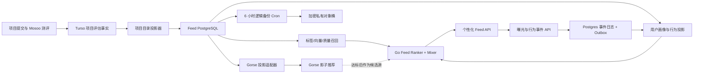

# GitHub 项目个性化 Feed 后端架构与分期实施方案

日期：2026-08-13

状态：Phase 1/2 首期代码已落地、等待 staging 数据/性能验收；Baseline 发布不依赖 Gorse 或固定 shadow 天数；Phase 3/4 的 allowlist、影子投影和观测底座已落地；Phase 5 可按安全样本门槛快速晋级，Phase 6 仍由数据成熟度锁定

基线：`upstream/main@77e73d10b7a1de172912dd15dd144ea13758e0c2`

## 1. 总体结论

新增一个仅面向 GitHub OAuth 用户的项目 Feed。候选内容来自用户主动提交并完成评估、且通过发布硬门槛的 GitHub 项目。

采用以下职责边界：

- Turso 继续作为项目身份、仓库图谱、分析运行和测评结果的事实源。
- 新增 Feed PostgreSQL，保存标签治理、用户画像、向量、推荐事件、曝光记录和实验数据。
- Go API 负责鉴权、候选召回、硬过滤、业务排序、多样性、探索抖动和降级。
- RabbitMQ 承担项目投影、事件投影、画像重算和 Gorse 同步任务。
- Gorse 先影子运行，通过门槛后只作为候选召回源；不得成为业务事实源、最终过滤器或唯一排序器。
- Upstash 仅保存短期 Feed session/cursor，不保存不可恢复的用户行为事实。
- 不依赖 Railway Pro 的 volume backup/PITR：独立 Cron 使用 PostgreSQL 17
  `pg_dump` 备份不可重建的 `feed` schema，经客户端 AES-256-GCM 加密后写入
  私有 S3-compatible Bucket；Gorse 和 Turso 投影仍从事实源重建。
- 首期不实现前端，但固定前端后续必须遵守的曝光和行为事件语义。



### 技术选型

选择 [Gorse](https://github.com/gorse-io/gorse) 作为第二阶段推荐引擎。它原生支持用户/项目 JSON 标签、标签和 embedding 相似度、Item-to-Item、User-to-User、协同过滤、反馈语义和多路推荐管线，官方示例本身就是 GitHub 仓库推荐。[数据模型](https://gorse.io/docs/concepts/data-source)、[推荐管线](https://gorse.io/docs/concepts/pipeline)、[Item-to-Item](https://gorse.io/docs/concepts/recommenders/item-to-item)。

初期锁定 `v0.5.11` 并固定容器 digest，禁止使用 `latest` 或 `nightly`。由于 Gorse 仍是 `0.x`，所有接入必须通过内部 adapter，避免业务代码绑定其 API 和表结构。

实现核验（2026-08-13）：`zhenghaoz/gorse-in-one:0.5.11` 的多架构 index digest 固定为 `sha256:b249a44b6affabde48a88c0438ebfd810edbb91f872f8dc080286f460a4f0ee7`；pgvector 固定为 `pgvector/pgvector:0.8.1-pg17-trixie@sha256:137f044b0efe3d57f39b972b9b53641b1f2045b99d879e298bbf514a25787dcf`。

不在首期采用：

- Vespa：适合百万级复杂混合检索和多阶段模型排序，但运维成本超过当前需求。
- Qdrant：适合作为向量召回组件，但不提供完整的反馈、用户模型和多路推荐语义。
- Metarank：适合已有候选集合后的 LTR，不解决目录、反馈事实和候选召回。
- LLM 在线重排：成本、尾延迟、稳定性和可解释性不适合首期 Feed 请求路径。

PostgreSQL 使用 [pgvector](https://github.com/pgvector/pgvector) 保存和检索向量；小目录先精确 cosine 查询，目录超过 50,000 个有效项目或向量查询 p95 超过 100ms 后再启用 HNSW。

## 2. 后端数据、标签和推荐契约

### 2.1 项目进入 Feed 的硬门槛

项目必须满足：

- 对应分析运行已完成，artifact schema、仓库身份和 commit SHA 校验通过。
- 至少达到 `source_inspected`；`metadata_only` 不进入个性化 Feed。
- 项目未被管理员移除、仓库未隐藏或失效。
- 不存在 `critical` 风险；`license`、`security`、`supply_chain`、`privacy` 类 `high` 风险默认阻断，可由管理员带审计理由覆盖。
- 不要求 `treasure_eligible` 或 `classic_eligible`；产品分、置信度、榜单资格只是排序特征。
- 项目分数低不会自动阻断，避免 Feed 退化为另一个榜单。

Turso 是这些事实的权威来源。`feed.projects` 只是带 `source_hash`、`analysis_id` 和 `projected_at` 的可重建投影。

分析完成后发布幂等的 `feed.project-sync.v1`，同时运行带重叠窗口的周期 reconciliation；消息丢失不得造成项目永久缺席。隐藏或风险状态变化必须在 60 秒内传播到 Feed 和 Gorse。

### 2.2 半限制标签体系

固定六个 namespace：

- `domain`：项目解决的问题领域。
- `use_case`：用户要完成的任务。
- `audience`：目标用户或团队。
- `artifact`：CLI、SDK、Web App、基础设施等交付形态。
- `stack`：语言、框架、运行环境和生态。
- `stage`：实验、活跃演进、稳定维护、功能完成等阶段。

标签状态为 `canonical`、`alias`、`proposed`、`rejected`、`deprecated`。项目 owner、普通用户和 Agent 都只能提议标签，不能直接创建 canonical 标签。当前 assessment 的 `product_tags` 被视为带证据的候选输入；命中 canonical/alias 后才写入有效 `project_tags`，未命中时进入审核队列，不能通过模糊匹配自动生效。

主要 PostgreSQL 表：

- `feed.projects`：Turso 项目评估投影与发布状态。
- `feed.tag_definitions`、`tag_aliases`、`tag_proposals`、`project_tags`。
- `feed.users`、`user_tag_preferences`、`user_project_state`。
- `feed.project_embeddings`、`tag_embeddings`、`user_profile_embeddings`。
- `feed.requests`、`served_items`、`events`、`event_outbox`。
- `feed.projection_cursors`、`projection_failures`、`algorithm_configs`。

`project_tags` 保存 `source`、`weight`、`confidence`、`evidence_ids`、`analysis_id` 和 taxonomy version，不能只保存 slug 数组。

### 2.3 Embedding 和用户画像

项目 embedding 编码项目名、summary、pain statement、target users、project type/lifecycle、canonical tags、language/topics。每条向量保存 `model`、`dimensions`、`descriptor_hash` 和生成时间；描述未变化时不得重复生成，模型升级写新版本，完成重建后再切 active model。

用户向量信号权重：显式感兴趣 `+1.00`、显式不感兴趣 `-1.00`、Save `+0.75`、GitHub outbound `+0.50`、合格详情浏览 `+0.20`、现有公开仓库/语言/facets `+0.20～0.35`。“不感兴趣”项目是项目级硬排除。行为按 90 天半衰期衰减，显式偏好不自动衰减。

### 2.4 Feed API

所有接口由 Go 后端拥有，使用现有 `ghfind_session` 中稳定的 `github_id`；匿名用户返回 `401 authentication_required`，仍可使用原有公开 `/api/projects`。

- `GET /api/feed/tags`
- `GET /api/feed/preferences`
- `PUT /api/feed/preferences`
- `GET /api/feed/projects?limit=20&cursor=...`
- `PUT /api/feed/projects/{owner}/{repo}/state`
- `POST /api/feed/events`
- `DELETE /api/feed/profile`
- `POST /api/internal/feed/projects/reconcile`

Feed 响应不暴露内部打分，只返回 request ID、算法/词表版本、项目、推荐原因、签名 impression token、下一页 cursor 和降级原因。

当前固定原因枚举为 `matches_tags`、`similar_to_saved`、`high_product_value`、`newly_evaluated`、`long_tail_discovery` 和兜底的 `catalog_discovery`；兜底原因不得伪称项目一定拥有高产品分。

Cursor 只包含签名后的 session ID、offset 和过期时间。候选序列存入 Upstash 30 分钟。Redis 故障时首页仍可返回确定性结果，但不返回下一页；cursor 过期返回 `410 feed_cursor_expired`。每个 impression token 绑定用户、项目、request、rank、算法版本和有效期。

### 2.5 基线召回、排序和随机探索

每次最多形成 240 个候选：canonical tag Top 80、pgvector Top 80、新评估 Top 40、高产品价值/低曝光 Top 40。

硬过滤先于打分：隐藏/风险阻断、用户 `notInterested`、重复 repo；最近 30 天已经产生有效 impression 的项目默认排除，池不足时可从 7 天前内容按衰减分重新引入；同一 owner 每 20 个结果最多 2 个。

```text
score =
  0.38 * tag_affinity
+ 0.30 * semantic_similarity
+ 0.14 * product_score
+ 0.06 * confidence
+ 0.06 * freshness
+ 0.06 * discovery_boost
```

缺少 embedding 时重新归一化剩余权重，不把缺失值当零分。排序后使用 `λ=0.78` 的 MMR。随机抖动不做整页 shuffle，每个位置使用 `0.90 * deterministic_best + 0.10 * softmax_exploration_pool`，每页最多两个探索项目，种子由 HMAC(user ID, request ID, algorithm version) 生成，并记录条件 propensity。

### 2.6 行为事实和 Gorse 投影

曝光定义为“卡片至少 50% 可见且持续 1 秒”。`impression` 是 read；`detail_open`/`dwell` 是弱信号；`save`、`github_outbound`、`share` 是正反馈；`not_interested` 是明确负反馈。快速划过不能自动视为负反馈。

API 在同一 PostgreSQL 事务写入不可变 `events` 和 `event_outbox`。事件 UUID 唯一，重放不得重复累计。RabbitMQ 或 Gorse 故障时原始事件仍安全。

Gorse User ID 使用 `gh:<github_id>`，Item ID 使用 `<owner>:<repo>`。Gorse 通过 adapter 接收 user/item/feedback 投影，不直接读取业务表。`impression` 映射 read，`save`/`github_outbound`/`qualified_view`/`share` 映射 positive，`not_interested` 映射 negative；禁止自动创建未知 user/item。

兼容性说明：经 `v0.5.11` 官方配置核验，Gorse 当前暴露 `positive_feedback_types` 和 `read_feedback_types`，没有计划草案中假定的 `negative_feedback_types` 配置项。因此实现会持久化 `not_interested` 的 `-1` 投影用于重建/审计，但绝不依赖 Gorse 执行负向硬过滤；Go 层的项目级排除始终是唯一强制语义。升级或启用 Gorse 学习排序前，必须用锁定版本的 contract test 证明负值如何进入具体模型，不能臆测配置项。

## 3. 分阶段推进

### Phase 1：数据底座与项目目录

- 独立 migration binary 和版本化 SQL；API/worker 继续禁止 DDL。
- Railway 增加带持久卷、仅私网的 pgvector/Postgres。
- 建立标签、项目投影、向量和 projection cursor schema。
- 全量回填 assessment，随后增量同步和周期 reconciliation。
- taxonomy seed 和人工 canonical/alias 审核。
- embedding worker、内容 hash 去重、重试和 DLQ。
- Hobby 可用的私有对象 Bucket 与每 6 小时 Cron；archive 上传后必须下载、
  校验 SHA-256、解密并经 `pg_restore --list` 解析，成功后才写 completion manifest。

退出门槛：可发布 assessment 100% 对账、增量投影 p95 小于 5 分钟、三次 reconciliation 无永久差异、proposed tag 不参与召回、隐藏传播小于 60 秒、embedding 故障不阻止 tag-only 目录；备份/解密/独立 scratch restore 演练通过。逻辑备份提供约 6 小时 RPO，不假装提供秒级 PITR。

### Phase 2：确定性 Baseline API

- OAuth 用户懒创建、显式偏好和 Turso 图谱冷启动。
- 标签、pgvector、质量、新项目四路召回。
- 统一打分、MMR、探索策略、Feed session/cursor 和 reason codes。
- request/served item/propensity 日志。
- preferences、state、events 和 profile delete API。
- `FEED_MODE=off|baseline|baseline_gorse_shadow|gorse_canary`，默认 `off`。

退出门槛：固定输入/seed 顺序完全相同；分页无重复；notInterested 永不返回；20 项 warm p95 ≤400ms、p99 ≤900ms；事件 p95 ≤200ms 且幂等；Postgres 故障不影响现有接口。

### Phase 3：内部 Baseline Canary

只对固定 GitHub ID allowlist 开启，然后按稳定 HMAC bucket 扩至 5%、25%、100%。原始 events 保存 180 天，request/served feature 保存 90 天；不保存 Feed 事件 IP、User-Agent 或任意客户端 JSON。核心指标包括 qualified discovery、save/outbound/not-interested、新用户首会话成功、目录覆盖、长尾曝光、多样性和曝光 Gini，不以原始 CTR 为唯一目标。

### Phase 4：Gorse 影子运行

Railway 增加私网 `gorse-in-one`，锁定 `v0.5.11` 和 digest；Gorse dashboard/API/数据库不暴露公网。全量同步项目/用户/反馈，保存 shadow Top 100、耗时、无效项目、baseline overlap 和 held-out recall。Gorse 不影响线上顺序。

影子运行不是 Baseline 上线前置，也不再使用“等满 14 天”这种与早期流量不匹配的日历门槛。Gorse live 只需先满足不可豪免的安全门槛：锁定容器 contract 通过；全量 rebuild 后项目/用户/反馈计数对账；隐藏、风险阻断和 not-interested 泄漏为 0；投影 lag p95 <5 分钟；连续 100 次私网推荐请求成功率 ≥99% 且 p95 <200ms。不足 100 次可用固定 staging fixture 补足运行安全样本，但不得把合成样本当作产品质量证据。

`Recall@50` 改为持续诊断而非冷启动发布门槛。结果窗口由 `FEED_SHADOW_OUTCOME_WINDOW` 记录，默认 24 小时、可缩短到 1 小时；每条评估保存实际窗口，避免混用不同窗口。原定的 500 项目/200 活跃用户/2,000 正反馈改为启用 collaborative filtering/FM 的门槛，不阻止 tag/embedding 候选源。

### Phase 5：Gorse 受控加入候选池

取消每级固定等 7 天。先用明确的内部 GitHub ID 完成至少 20 个交互 Feed session，再按 5%→25%→100% sticky cohort 晋级；每级改用至少 100/250/500 次 Gorse-live Feed 请求作为可比样本门槛。如果早期 OAuth 活跃用户太少，百分比分桶没有统计意义，可在完成内部 allowlist 后直接开到 100%，但必须由 operator 显式接受“推荐质量尚无统计结论”，并保留独立 kill switch。

Gorse-exclusive 候选最多占 mixer 前候选的 25%；Go 始终执行 hydration、硬过滤、baseline score、MMR 和 exploration。5xx >1%、p95 上升 >30%、隐藏/阻断泄漏非零、not-interested 上升 >25% 或 qualified discovery 下降 >10% 时立刻把 `FEED_GORSE_LIVE_BPS` 归零。

代码能力已通过独立 `FEED_GORSE_LIVE_BPS` 实现且默认 `0`：200ms 超时、最多 60/240 个 Gorse-exclusive 候选、PostgreSQL 重水合和全部 Go 硬过滤、故障 Baseline 降级。只有 Phase 4 的安全样本门槛是提高 BPS 的必须前置；产品质量指标在受控上线后继续观测，不要伪造冷启动时不存在的统计显著性。

### Phase 6：数据成熟后的学习排序

至少 50,000 个用户-项目正反馈且 propensity 完整率 ≥99% 后，才评估 Gorse collaborative/FM、LTR 和 contextual bandit。大于百万项目或 pgvector 无法满足延迟时再评估 Vespa/Qdrant。首期不允许无 propensity 的 bandit 和 LLM 在线重排。

## 4. 测试、故障和运维验收

自动化测试覆盖纯排序函数、性质约束、PostgreSQL migration/幂等/outbox、Turso 投影乱序/重放、Gorse contract、OAuth/限流/签名攻击和代表性性能。

必须验证：Gorse 故障时 baseline 正常；embedding 故障保留旧向量并 tag-only；Rabbit 故障不丢事件；Upstash 故障首页无 cursor；Turso 故障使用最近项目投影；Feed PostgreSQL 故障仅让 Feed 返回 `503 feed_unavailable`。

Railway 拓扑：`ghfind-feed-postgres`、`ghfind-feed-backup`、私有 `ghfind-feed-backups` Bucket、可选 `ghfind-gorse`、现有 `ghfind-api` 和 `ghfind-worker`。这一拓扑只使用 Hobby 可获得的持久卷、Cron 与 Bucket，不把 Pro volume backup/PITR 作为发布依赖。staging 数据必须独立；`vector` 和 Gorse `v0.5.11` 所需的 `btree_gin` 扩展由数据库 operator 一次性受控激活，运行时 Gorse 使用无 `feed.*` 权限的独立 role；生产 migration 只执行 expand/contract；关闭使用 `FEED_MODE=off` 而不是回滚数据。

关键指标：

- `ghfind_feed_request_duration_seconds`
- `ghfind_feed_requests_total{algorithm,result}`
- `ghfind_feed_candidates_total{source}`
- `ghfind_feed_served_total{source,exploration}`
- `ghfind_feed_events_total{type,result}`
- `ghfind_feed_projection_lag_seconds{projection}`
- `ghfind_feed_catalog_orphans`
- `ghfind_feed_gorse_shadow_duration_seconds`
- `ghfind_feed_gorse_overlap_ratio`

## 5. 明确假设与非目标

- 首期只支持 GitHub OAuth，不建立匿名画像。
- 冷启动不申请额外 GitHub 权限。
- 目录只包含完成测评且可公开推荐的项目，但不限制为榜单项目。
- Turso 不迁移；Postgres 只拥有 Feed 事实和可重建投影。
- Gorse 永远不是事件事实源、标签审核系统、最终过滤器或唯一排序器。
- 首期不包含 Feed 前端、收费、套餐、组织租户、广告位或 sponsored content。

## 6. 当前代码落点与仍需真实环境验收的边界

已实现：独立 migration binary、十四版 `feed.*` schema、项目硬门槛/乱序保护/空快照保护、提交后事件驱动目录同步、30 秒 `(updated_at,repo_key)` 增量 repair（五分钟重叠）与首次/六小时/数量减少时的全量 anti-entropy、跨副本 PostgreSQL 租约、候选召回关键路径索引（每标签有界 fanout；迁移角色在 50k 活跃向量后并发创建维度专属 HNSW，API/worker 永不执行 DDL）、单调 projection version、仅限 high-risk 的带审计管理员覆盖、taxonomy proposal/admin review（proposal 绑定 analysis identity、相同 current proposal 批量激活、legacy 标签必须人工指定 namespace）、严格只由 canonical tag 构成的语义 descriptor、embedding 去重/指数重试/DLQ/模型原子切换、带六小时刷新租约的图谱冷启动画像、90 天半衰期用户向量、四类五路召回、缺失信号重归一、MMR/逐页探索 propensity、OAuth API、签名 cursor/impression token、每页重新执行 publishable/notInterested 硬过滤、Upstash 读降级与写失败关闭、不可变事件/outbox、RabbitMQ relay、Gorse `0.5.11` adapter/影子 consumer/可重复全量重建/删除 tombstone/受控 live 候选源、可配置且可审计窗口的 Recall@50、retention、sticky allowlist/BPS、OpenAPI 和同源 rewrite；Feed PostgreSQL/Gorse 已从原 API/worker 启动和全局 readiness 隔离，另有严格验证 migration ledger、active taxonomy/algorithm 的专用 `/feed-readyz` 发布探针。还实现了不依赖 Pro 的流式加密逻辑备份、对象存储回读验证、显式目标恢复工具、35 天保留和 main gate Cron 镜像部署。

已在本地真实 PostgreSQL 17/pgvector 源库与独立 scratch 库完成一次恢复演练；当时恢复前后均为 10 个 migration、24 张 `feed` 表。当前 migrations 11..14 只增加 reconciliation/candidate-path/graph-refresh/tag-proposal identity 数据，不改变表数；CI 会在真实 PostgreSQL 17/pgvector 临时服务上从零应用 1..14 并执行 store 集成测试。同一备份实现也已对真实 Railway Bucket 完成加密上传与回读验证。不能由代码提交宣称已达成：生产数据出现后的持续 Cron 成功率、100% Turso 对账、连续三次 clean reconciliation、50 并发 p95/p99、真实产品质量提升和各 cohort 的产品指标。这些会在 staging/生产持续生成证据，但不得用固定 7/14 天日历等待阻止 Baseline 发布。Gorse 未通过安全样本门槛时保持 `FEED_GORSE_LIVE_BPS=0`；Feed 本身仍可以 `FEED_MODE=baseline` 运行。
