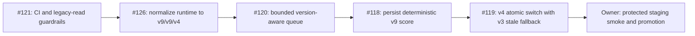

# v9 / v9 / v4 release plan

## Formal lineage

| Component | Previous release | Target release | Read behavior during rollout |
| --- | --- | --- | --- |
| Deterministic score | v8 | v9 | Prefer v9; keep the last complete v8 score visible |
| Roast report | v8 | v9 | Replay only when both score and roast are v9 |
| Public collection | v3 | v4 | Prefer complete v4; use complete v3 only as an explicit stale fallback |

Unpublished local version values are not release versions. They are not aliases,
replay inputs, backfill sources, or migration targets.

## Rollout sequence

The first guardrail phase uses `source_changes_only`: CI permits the untouched
pre-normalization source, but any pull request that edits a version constant must
set all edited runtime values directly to the formal target. #126 changes the
manifest to `canonical`, after which every CI run requires exact runtime equality.

## Capacity and write policy

- A deploy must not enqueue work merely because a stored version is old.
- Profile, score, search, leaderboard, facet, sitemap, project, similar, and
  following reads continue serving the last complete stored score.
- Only an explicit scan or roast flow may request refresh work.
- New collection work is bounded and version-aware before v4 is enabled.
- No global rescore, recollection, or roast regeneration runs during promotion.

## Rollback

1. Stop new scan admission with the queue kill switch.
2. Revert the isolated version-enablement pull request and its manifest state.
3. Keep public reads on the last complete v8 score and complete v3 collection.
4. Do not rewrite, alias, or replay unpublished local-version rows.
5. Promote only after profile, score API, search, leaderboard, facet, scan status,
   and canonical-origin smoke checks pass against staging.

The scoring formula and the removal of model-authored score deltas are outside
this release-control change and must remain covered by the existing test suite.

## Owner controls

The owner must use isolated staging Turso, Redis, GitHub quota, and Cron secrets.
After this workflow lands, configure `Verify release` as a required check on
`dev` and `main`, and make the private deployment smoke a promotion gate.
