# v9 / v9 / v4 release plan

## Formal lineage

| Component | Previous release | Target release | Read behavior during rollout |
| --- | --- | --- | --- |
| Deterministic score | v8 | v9 | Prefer v9; keep the last complete v8 score visible |
| Roast report | v8 | v9 | Replay only when both score and roast are v9 |
| Public collection | v3 | v4 | Prefer complete v4; use complete v3 only as an explicit stale fallback |

Unpublished local version values are not release versions. They are not aliases,
replay inputs, backfill sources, or migration targets.

## Rollout sequence

```mermaid
flowchart LR
  A["#121: CI and legacy-read guardrails"] --> B["#126: normalize runtime to v9/v9/v4"]
  B --> C["#120: targeted durable jobs and queue metrics"]
  C --> D["#124: event admission and overload controls"]
  D --> E["#118: persist deterministic v9 score"]
  E --> F["#122 and #125: origin check and event UI"]
  F --> G["#119: optional v3 stale fallback"]
  G --> H["Owner: protected staging smoke and promotion"]
```



The first guardrail phase uses `source_changes_only`: CI permits the untouched
pre-normalization source, but any pull request that edits a version constant must
set all edited runtime values directly to the formal target. #126 changes the
manifest to `canonical`, after which every CI run requires exact runtime equality.
Pull requests compare against their target branch; direct pushes compare against
the event's previous commit. After normalization, no approval field can permit a
multi-component bump, and release history cannot be rewritten in place.

## Capacity and write policy

- A deploy must not enqueue work merely because a stored version is old.
- Profile, score, search, leaderboard, facet, sitemap, project, similar, and
  following reads continue serving the last complete stored score.
- Only an explicit scan or roast flow may request refresh work.
- New collection work is bounded and version-aware before v4 is enabled.
- Worker recovery and claim are restricted to v4 before any GitHub call.
- Non-v4 active jobs do not consume v4 admission capacity. Their quarantine is
  aggregate-only, dry-run by default, environment-gated, and hard-capped per call.
- Quarantine defers a running job while its lease is valid and never releases an
  execution slot early; expired work is fenced before it is marked obsolete.
- A profile page read never starts a snapshot backfill merely because evidence
  is absent; explicit write endpoints remain the only refresh entry points.
- Default-model score/report writes require a server-produced quick scan or a
  complete durable snapshot. A client-provided scan is BYO-only, immediate, and
  cannot write scores, cache reports, or create durable collection work.
- Quick-scan cache identity depends only on the collection contract and scores
  are recomputed on read. Report and single-flight identities depend on the
  collection, score, and roast contracts together.
- No global rescore, recollection, or roast regeneration runs during promotion.

Queue metrics, privacy-safe structured logs, alert thresholds, and owner-only
Vercel steps are documented in
[`docs/operations/public-scan-monitoring.md`](../operations/public-scan-monitoring.md).

## #126 normalization boundary

This normalization does not persist a score when a durable scan completes. #118
owns the idempotent v4-snapshot to v9-score write and the atomic replacement of a
stale score. Until then, a complete v4 snapshot is factual input only.

When a score version or deterministic result changes, previously generated roast
text is detached. A roast write is accepted only while the account row still has
the exact score-write token and timestamp, preventing both cross-release and
same-release late reports from attaching to a newer scan.

## v3 stale-read fallback

When no valid complete v4 snapshot exists, public scan status may serve the
newest complete v3 snapshot only after its hash, account identity, coverage,
required sources, payload shape, and stored-score shape all validate. The
response marks `stale`, `served_collection_version=v3`, and
`target_collection_version=v4`. It never materializes a v9 score or report
from v3 evidence.

Passive profile, score, search, leaderboard, facet, sitemap, and MCP reads do
not create a refresh. An explicit scan may create at most one v4 job and keeps
returning the v3 snapshot while that refresh is pending or failed. v5 and every
other non-formal collection remain ineligible for this path.

## v5 emergency artifact fallback

The canonical runtime remains v9/v9/v4. Separately, a read-only continuity
path may expose an already-persisted v5 score and v5 roast only when the same
account has a complete, hash-validated v3 public snapshot recorded with score
version v5. This exact v5/v5/v3 tuple is not an alias, a formal compatibility
target, a queue target, or a write/migration source.

The fallback serves existing profile and score reads as stale and can replay the
stored report without an LLM configuration, Cron run, cache write, scan, or score
materialization. A home-page explicit scan first returns the verified v5/v5/v3
profile and report handoff, then best-effort starts or resumes only its canonical
v9/v4 refresh; queue admission or storage failure cannot turn that readable
result into a waiting screen. It never reconstructs a report from
`score_snapshots`: those rows do not contain report markdown. Missing,
mismatched, corrupt, or incomplete tuple members fail closed.

## Obsolete-job quarantine

The operator endpoint returns aggregate counts only:

```bash
curl -fsS -H "x-admin-secret: $ADMIN_SECRET" \
  "$BASE_URL/api/admin/public-scan-jobs"
curl -fsS -X POST -H "x-admin-secret: $ADMIN_SECRET" \
  -H "content-type: application/json" \
  --data '{"limit":25}' \
  "$BASE_URL/api/admin/public-scan-jobs"
```

Both calls above are read-only. To apply one bounded batch, set
`PUBLIC_SCAN_QUARANTINE_ENABLED=1` on the intended deployment and send
`{"apply":true,"limit":25}`. Keep invoking dry-run between batches; a positive
`deferredActive` means a running lease is still valid and must be allowed to
expire. Disable the environment switch after the aggregate count reaches zero.

## Rollback

1. Stop new scan admission with the queue kill switch.
2. Revert the isolated version-enablement pull request and its manifest state.
3. Keep public reads on the last complete v8 score and complete v3 collection.
4. Do not rewrite, alias, or replay unpublished local-version rows.
5. Promote only after profile, score API, search, leaderboard, facet, scan status,
   and canonical-origin smoke checks pass against staging.

The scoring formula and the removal of model-authored score deltas are outside
this release-control change and must remain covered by the existing test suite.

## Owner controls

The owner must use isolated staging Turso, Redis, GitHub quota, and Cron secrets.
After this workflow lands, configure `Verify release` as a required check on
`dev` and `main`, and make the private deployment smoke a promotion gate.
